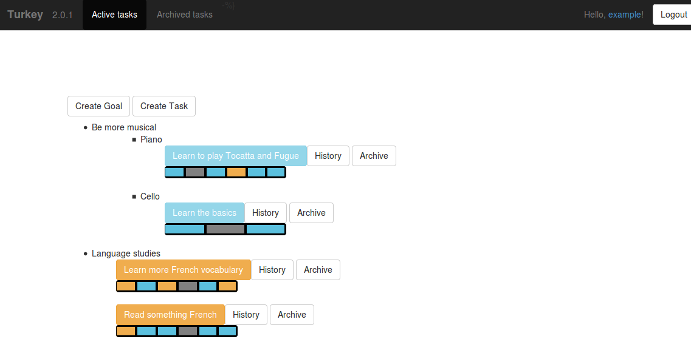

This project has been disabled as it is no longer maintained and has insecure dependencies.
It has been left online in case of any future interest.
To re-enable it, dependencies in requirements.txt and setup.py should be uncommented.

## A browser based tool to encourage me to actually get on and do stuff.

# With many thanks to:
- All who were involved in creating Bootstrap, Flask, SQLAlchemy, and the other amazing projects that have turned this into a few evenings of hacking instead of a month of tedium to get up and running.
- crdoconnor (https://github.com/crdoconnor) for getting the tests up and running with his BDD test suite, 'hitch'.

# Installation:
- Tested on Ubuntu 14.04.
- Requires: git, python3, virtualenv

1. git clone https://github.com/geokala/turkey.git
2. cd turkey
3. virtualenv . --python=python3
4. . bin/activate
5. pip install -r requirements.txt
6. \# Optionally create a turkey.conf file from turkey.conf.example. DB path, if set, must be absolute
7. ./manage.py db upgrade  # If you did not create a turkey.conf file then the db will be in <home dir>/.turkey.db

# Running:
- Tested on Ubuntu 14.04.
- From turkey dir created during installation (not turkey/turkey).

1. . bin/activate
2. ./manage.py runserver

# Upgrade:

1. git fetch origin  # Assuming you haven't changed the geokala/turkey.git from being origin. If you have, you will know
2. git rebase origin/master
3. ./manage.py db upgrade

# Usage:
- Access on localhost:5000
- Click register to register (you don't have to verify your e-mail address currently).
- Login after registering.
- Disable user registrations if desired via the site administration panel.
- Create goals, optionally with subgoals.
- Under each goal, create tasks.
- Tasks are intended to be performed daily on the current version- little (or lots) and often.
- When you have created tasks they will appear on the home screen in orange (if you haven't completed them today) and can be clicked on to complete them (optionally with a comment that is visible under the task info display). Once completed, they will turn blue for the remainder of the day. You may need to refresh the following day if you still have the page open.
- Tracking of success rates, and possibly metrics, coming soon.

# But what does it look like?

Orange elements indicate a day when a task wasn't performed (or not performed yet, for the current day).
Blue elements indicate a day when a task was performed.
Gray elements indicate a day when a task was missed for a good reason.

# Licensing
All code not otherwise noted is under a BSD 3-clause license.
jQuery, bootstrap-growl, and Twitter's Bootstrap are used under the MIT license.
bootstrap-datepicker is used under the Apache Public License.

- jQuery: http://jquery.com
- bootstrap-growl: http://bootstrap-growl.remabledesigns.com/
- Bootstrap: http://getbootstrap.com
- Bootstrap-datepicker: https://github.com/eternicode/bootstrap-datepicker

